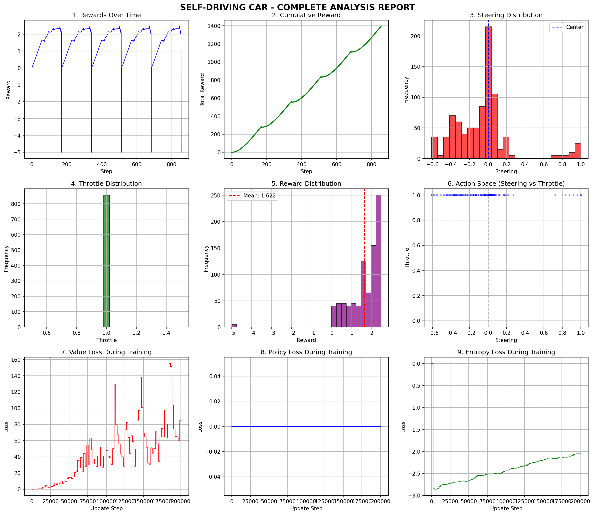

# Self Driving Car using Reinforcement Learning 

This project implements a self‑driving car using Proximal Policy Optimization (PPO) in the MetaDrive simulator. The agent learns to drive safely, stay on the road, and reach its destination through deep reinforcement learning with domain randomization and curriculum learning.

## Team Members
- K Karthik Sai Chaitanya (Team Lead) - 524144
- A Sai Teja - 524108
- R Vamsi Meenan - 524168

## Project Explanation
Watch our project explanation:
[![Link]](https://youtu.be/9m7jEpj1QhY?si=ccVJPZIUCj4lyfSU)

## Setup Instructions

### 1. Install Python 3.8

Make sure you have Python 3.8 installed. You can download it from python.org.

### 2. Create a Virtual Environment

```bash
cd Code
python -m venv venv_driving
venv_driving\Scripts\activate   # Windows
# source venv_driving/bin/activate   # Linux/Mac
```

### 3. Install Requirements

Install all required dependencies using pip:

```bash
cd Code
pip install -r requirements.txt
```

If you don't have a requirements.txt, install manually:
```bash
pip install torch torchvision torchaudio --index-url https://download.pytorch.org/whl/cpu
pip install metadrive-simulator==0.4.3 stable-baselines3==2.2.1 gymnasium==0.29.1 numpy==1.23.5
pip install matplotlib pandas tqdm scipy opencv-python pillow imageio python-pptx
```

### 4. Run the Live Demo

```bash
cd Code
python video.py
```
A MetaDrive window will open – the car will drive automatically. Press Ctrl+C to stop.


### 5. Train a New Model
If you want to train from scratch, run:

```bash
cd Code
python train_and_animate.py
```
When asked “Use existing model? (y/n)”, type n. Training takes 30‑40 minutes.

### 5. Train a New Model
If you want to train from scratch, run:

```bash
cd Code
python generate_ppt.py
```
The file Self_Driving_Car_Presentation.pptx will be created.

## Project Structure

```
Code/
├── main.py                    # Orchestrator: dataset management, training, demo
├── train_and_animate.py      # Trains PPO, generates GIF, charts, summary
├── video.py                  # Live demo with best model selection
├── collect_dataset.py        # Collects 500,000 driving samples
├── generate_ppt.py           # Creates PowerPoint from outputs
├── models_saved/             # Trained PPO models (.zip)
├── requirements.txt          # Dependencies
└── README.md                 # This file

assets/                       # Presentation slides and report (1‑slide PPT, PDF)
data/                         # Shell script (download_dataset.sh) – optional
```

## Performance GIF (Animated)

* Animated graph showing reward, steering, throttle, and cumulative reward over time.*
## Panel Analysis Chart

*Includes: rewards, cumulative reward, steering/throttle distributions, reward distribution, action space, value/policy/entropy loss curves.*

## Key Techniques

- ###### Domain Randomization:
  Randomises friction, gravity, mass, LiDAR noise, traffic density, weather, and lighting at every reset – improves sim‑to‑real transfer.
- ###### Curriculum Learning:
  Progresses from straight road → curves → mixed → city → roundabout as training advances.
- ###### Dataset Collection:
   500,000 samples collected with progressive difficulty (random → straight → moderate → aggressive → expert).
- ###### PPO Optimisation:
   Hyperparameters tuned for MetaDrive (learning rate 2.5e-4, n_steps 4096, batch size 128, ent_coef 0.005).
 
## System Requirements

- Python 3.8+
- 8 GB RAM (minimum)
- 2 GB free disk space (for dataset and models)
- CPU only (GPU optional for faster training)
