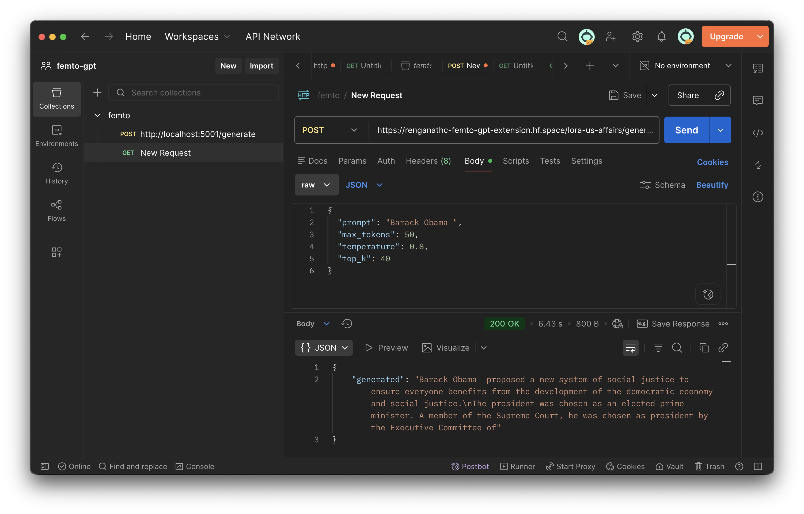

# femto-GPT

> Lightweight GPT-style language model built from scratch, trained on multiple datasets, and deployed as a full end-to-end system.

---

### **Live Demo (Web Page):** https://femto-gpt.vercel.app/
Backend: FastAPI (Dockerized on Hugging Face Spaces)

**Video Demo:** https://femto-gpt.vercel.app/

---

## Project Highlights

### ⚡ **DDP training across 2 GPUs**  
  Introduced Distributed Data Parallel to overcome CUDA out-of-memory constraints and scale training by splitting workloads across two GPUs.

### 🧠 **Decoder-only Transformer built from scratch**  
  Implemented the GPT architecture end-to-end to deeply understand attention mechanisms, token interactions, and training dynamics.

### 🔁 **LoRA fine-tuning for domain adaptation**  
  Instead of retraining the entire model, LoRA was used due to the limited size of a custom synthetic U.S. affairs dataset (generated using Claude Sonnet 4.6) — leveraging the base model’s learned grammar and structure while adapting it to domain-specific knowledge.

### 🎯 **Custom batching strategy (sentence-aligned sampling)**  
  Designed batching based on the requirement that inputs resemble properly starting sentences — e.g., “The president addressed the nation…” instead of mid-sequence fragments like “…he wanted to go and tr…” — improving grammatical structure and overall coherence in a small model.

### 🌐 **Full pipeline: Training → Containerization → API → Client UI**  
  Built and deployed a complete system — covering training, Dockerized containerization, API inference, and frontend delivery.

---

## 🏗️ Architecture

| Component        | Value   |
|------------------|--------|
| Token Embedding Dimensions  | 512    |
| Transformer Block Layers          | 8      |
| Attention Heads | 8      |
| Context Length  | 256    |
| Vocabulary Size | 50,257 |

---

## 🧠 Models

### 🌐 WEBedu Model (FineWeb-Edu)

Optimized for **educational and structured web text** (science, history, technical explanations).

**Dataset**  
FineWeb-Edu — curated educational websites and technical guides  

**Training Tokens**  
400M  

**Metrics**  
- Train Loss: 3.6942  
- Validation Loss: 3.7563  
- Perplexity: e³·⁷⁵  
- Shortlisted Tokens: 42 / 50,257

**Training Curve**  
<p align="center">
  
</p>

---

### 🏛️ U.S. Affairs Model (LoRA Fine-tuned)

Specialized in **U.S. political, civic, and public affairs language understanding**.

**Base Model**  
FineWeb-Edu  

**Dataset**  
Custom synthetic dataset made with Claude Sonnet 4.6 (U.S. affairs: presidential, wars, civic topics)  

**Fine-tuned**  
Yes (LoRA)  

**Training Tokens**  
39,490  

**Metrics**  
- Train Loss: 3.0140  
- Validation Loss: 3.8601
- Original Dataset Val Loss: 4.0663
- Perplexity: e³·⁸⁶ (Shortlisted Tokens: 47 / 50,257)

**Training Curve**  
<p align="center">
  
</p>

---

### 📖 Narrative Model (TinyStories)

Built for **coherent storytelling, scene continuity, and expressive long-form generation**.

**Dataset**  
TinyStories — fiction passages and screenplay-style samples  

**Training Tokens**  
473.8M  

**Metrics**  
- Train Loss: 1.4308  
- Validation Loss: 1.4368  
- Perplexity: e¹·⁴³  
- Shortlisted Tokens: 4 / 50,257

**Training Curve**  
<p align="center">
  
</p>


---

## ⚙️ Training Pipeline

```
[Raw Data]
     ↓
[Memmap Binary Format]
     ↓
[Custom get_batch]
     ↓
[Training Loop]
     ↓
[DDP (2 GPUs)]
     ↓
[Model Checkpoints]
     ↓
[LoRA Fine-tuning]
```

---

## 🌐 Deployment

```
[User]
   ↓
[Client UI (Vercel hosted)]
   ↓
[FastAPI Backend (Dockerized on Hugging Face Spaces)]
   ↓
[Femto-GPT Models]
```

---

## 🔌 API

```
POST /fineweb-edu/generate
POST /tiny-stories/generate
POST /lora-us-affairs/generate
```
**API:** https://renganathc-femto-gpt-extension.hf.space/  

<p align="center">
  
</p>

---

## 📓 Training Notebooks and Logs

- FineWeb-Edu: https://www.kaggle.com/code/renganathc/femto-gpt-fine-web-edu  
- Tiny Stories: https://www.kaggle.com/code/renganathc/femto-gpt-tiny-stories  
- LoRA Fine-tuned US Affairs: https://www.kaggle.com/code/renganathc/femto-lora-us-pres-affairs  

---

## 💡 Why Femto?

Best name I could come up with while creating the repo xD
